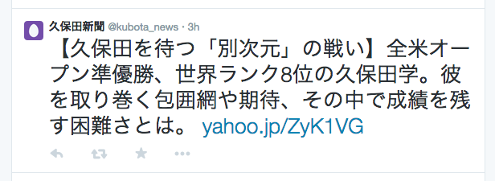

kubota-news
==
kubota news generator.



setup
--
### package
````
sudo apt-get install mecab mecab-ipadic-utf8 libmecab-dev
````

*optional:* follow the commands like below to use another dictionary.
````
sudo apt-get install mecab-naist-jdic
sudo update-alternatives --config mecab-dictionary

# show dictionary info
mecab -D
````

### python runtime
````
pyenv install 2.7.8
pyenv virtualenv 2.7.8 kubota-news-2.7.8
pip install http://sourceforge.net/projects/pychecker/files/pychecker/0.8.19/pychecker-0.8.19.tar.gz/download
pip install https://mecab.googlecode.com/files/mecab-python-0.993.tar.gz
pip install -r requirements.txt
````
* python prerequisite
    * python 2.x
        * mecab-python bindings does not yet officially support python 3.x.
    * mecab-python v.0.993
        * need mecab-python v.0.993, instead of later release like v.0.996.
        * with later release of mecab-python, we get gcc compile error when pip install.

### application
````
cp main.configuration.sample main.configuration
vi main.configuration
````

kick
--
````
./main.py
````

test
--
````
pychecker *.py news/*.py tests/*.py
py.test
pep8 *.py news/*.py tests/*.py
````

license
--
copyright &copy; 2014- honishi, hiroyuki onishi.

distributed under the [MIT license][mit].
[mit]: http://www.opensource.org/licenses/mit-license.php
